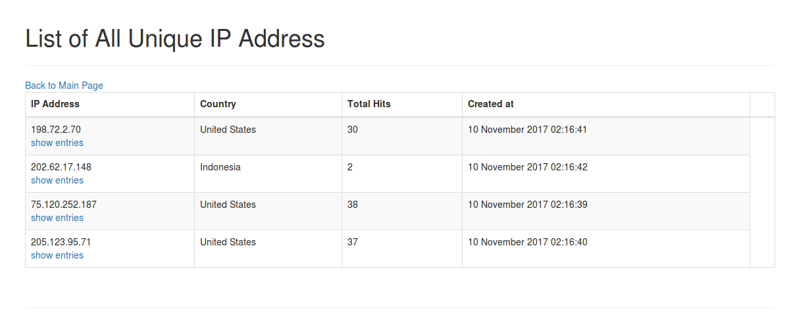

# Log Parser Web App
> Server log parser with python, running on Flask.

The flask app which parses the log and shows information about SQLi, 
remote file inclusion and web shells attacks.
Some Features Including:
- list of unique IP addresses
- list of unique IP addresses with country and number of hits
- list of all activity per IP address (can be filtered by this IP)
- detect SQLi with found entries
- detect remote file inclusion with found entries
- detect web shells with found entries

## Docker Setup

To running up this app with docker, you need list of these to be installed
on your computer:
- docker ([docker-installation])
- docker-machine ([docker-machine-instalation])
- docker-compose ([docker-compose-instalation])
- virtualbox ([virtualbox-download])


## App Installation with Docker
Installation process:
- clone this repo
- from terminal, change to this project root folder
- creating docker machine: 
```sh
docker-machine create -d virtualbox flask-dev
```
- check the installed docker machine:
```sh
eval "$(docker-machine env flask-dev)"
```
- build the app with docker-compose:
```sh
docker-compose build
```
- running up the app:
```sh
docker-compose up -d
```
(The -d flag is used to run the containers in the background)
- get the ip of docker-machine:
```sh
docker-machine ip flask-dev
```
- visit the ip on the browser with addition port number :5001 (http://ip-of-docker-machine:5001)

## Development Guide
- When you restart the computer you need to make sure that the docker-machine is running up.
To check it, use command: `docker-machine ls`. Check if flask-dev state is running.
- If it's not running, run the command `docker-machine start flask-dev`
- When you make a change on the code, you need to rebuild with command: 
`docker-compose up -d --build`.
- get the ip of docker-machine (see the last two points of installation guide) and visit.

## User Guide

Home menu is consisting 3 main menu, List of All unique IP Addresses, List of All Entries and 
Upload Log File Entry.


On List of All unique IP Addresses menu, there are list of unique client ip address, country of ip address, and
number of hits of the ip address. You can check all entry filtered by ip, just click the link below
the ip.


On List of All Entries menu, there are activity on raw logs, analyze result of attack type which are 
sqli (sql injection), rfi(remote file inclusion), and web shell attack. You can filter the entry by
clicking on the link or search by ip address on search bar with autocomplete.


On Upload Log File Entry menu, you can uploading log file to make an addition to the database.
P.S please don't upload to big file for now (<20mb). I attach log example file on this project 
root folder for you if you wanna try to upload and see the result, the file is named `practice.log`.


[docker-installation]: https://docs.docker.com/engine/installation/
[docker-machine-instalation]: https://docs.docker.com/machine/install-machine/
[docker-compose-instalation]: https://docs.docker.com/compose/install/
[virtualbox-download]: https://www.virtualbox.org/wiki/Downloads